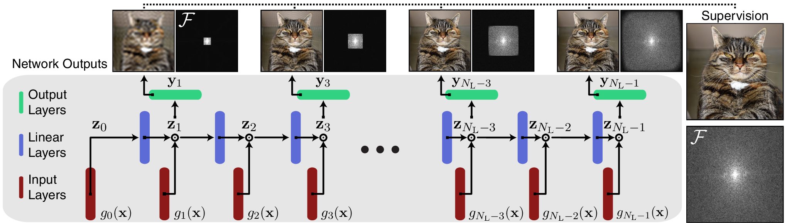

# BACON: Band-limited Coordinate Networks for Multiscale Scene Representation | CVPR 2022 (oral)
### [Project Page](http://www.computationalimaging.org/publications/bacon/) | [Video](https://www.youtube.com/watch?v=zIH3KUCgJEA) | [Paper](https://arxiv.org/abs/2112.04645)
Official PyTorch implementation of BACON.<br>
[BACON: Band-limited Coordinate Networks for Multiscale Scene Representation](http://www.computationalimaging.org/publications/bacon/)<br>
 [David B. Lindell](https://davidlindell.com)\*,
 [Dave Van Veen](https://davevanveen.com/),
 [Jeong Joon Park](https://jjparkcv.github.io/),
 [Gordon Wetzstein](https://computationalimaging.org)<br>
 Stanford University <br>



## Quickstart

To setup a conda environment use these commands
```
conda env create -f environment.yml
conda activate bacon

# download all datasets
python download_datasets.py
```
Now you can train networks to fit a 1D function, images, signed distance fields, or neural radiance fields with the following commands.

```
cd experiments
python train_1d.py --config ./config/1d/bacon_freq1.ini  # train 1D function
python train_img.py --config ./config/img/bacon.ini  # train image
python train_sdf.py --config ./config/sdf/bacon_armadillo.ini  # train SDF
python train_radiance_field.py --config ./config/nerf/bacon_lr.ini  # train NeRF
```

To visualize outputs in Tensorboard, run the following.
```
tensorboard --logdir=../logs --port=6006
```

## Band-limited Coordinate Networks

Band-limited coordinate networks have an analytical Fourier spectrum and interpretible behavior. We demonstrate using these networks for fitting simple 1D signals, images, 3D shapes via signed distance functions and neural radiance fields.

### Datasets

Datasets can be downloaded using the `download_datasets.py` script. This script
- downloads the synthetic Blender dataset from the [original NeRF paper](https://github.com/bmild/nerf),
- generates a multiscale version of the Blender dataset,
- downloads 3D models originating from the [Stanford 3D Scanning Repository](http://graphics.stanford.edu/data/3Dscanrep/), which we have adjusted to make watertight, and
- downloads an example image from the [Kodak dataset](http://www.cs.albany.edu/~xypan/research/snr/Kodak.html).

### Training

We provide scripts for training and configuration files to reproduce the results in the paper.

#### 1D Examples
To run the 1D examples, use the `experiments/train_1d.py` script with any of the config files in `experiments/config/1d`. These scripts allow training models with BACON, [Fourier Features](https://github.com/tancik/fourier-feature-networks), or [SIREN](https://github.com/vsitzmann/siren).
For example, to train a BACON model you can run 

```
python train_1d.py --config ./config/1d/bacon_freq1.ini
```

To change the bandwidth of BACON, adjust the maximum frequency with the `--max_freq` flag. 
This sets network-equivalent sampling rate used to represent the signal.
For example, if the signal you wish to represent has a maximum frequency of 5 cycles per unit interval, this value should be set to at least the Nyquist rate of 2 samples per cycle or 10 samples per unit interval.
By default, the frequencies represented by BACON are quantized to intervals of 2*pi; thus, the network is periodic over an interval from -0.5 to 0.5.
That is, the output of the network will repeat for input coordinates that exceed an absolute value of 0.5.

#### Image Fitting

Image fitting can be performed using the config files in `experiments/config/img` and the `train_img.py` script. We support training BACON, Fourier Features, SIREN, and networks with the positional encoding from [Mip-NeRF](https://github.com/google/mipnerf).

#### SDF Fitting

Config files for SDF fitting are in `experiments/config/sdf` and can be used with the `train_sdf.py` script. 
Be sure to download the example datasets before running this script.

We also provide a rendering script to extract meshes from the trained models. 
The `render_sdf.py` program extracts a mesh using marching cubes and, optionally, our proposed multiscale adaptive SDF evaluation procedure.

#### NeRF Reconstruction

Use the config files in `experiments/config/nerf` with the `train_radiance_field.py` script to train neural radiance fields.
Note that training the full resolution model can takes a while (a few days) so it may be easier to train a low-resolution model to get started.
We provide a low-resolution config file in `experiments/config/nerf/bacon_lr.ini`.

To render output images from a trained model, use the `render_nerf.py` script.
Note that the Blender synthetic datasets should be downloaded and the multiscale dataset generated before running this script.

#### Initialization Scheme

Finally, we also show a visualization of our initialization scheme in `experiments/plot_activation_distributions.py`. As shown in the paper, our initialization scheme prevents the distribution of activations from becoming vanishingly small, even for deep networks.


#### Pretrained models

For convenience, we include pretrained models for the SDF fitting and NeRF reconstruction tasks in the `pretrained_models` directory. 
The outputs of these models can be rendered directly using the `experiments/render_sdf.py` and `experiments/render_nerf.py` scripts.

## Citation

```
@article{lindell2021bacon,
author = {Lindell, David B. and Van Veen, Dave and Park, Jeong Joon and Wetzstein, Gordon},
title = {BACON: Band-limited coordinate networks for multiscale scene representation},
journal = {arXiv preprint arXiv:2112.04645},
year={2021}
}
```
## Acknowledgments

This project was supported in part by a PECASE by the ARO and NSF award 1839974.
